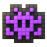

<div align="center">
  
  <h1>EasyUI</h1>
  <p><strong>Beautiful UI. Made easy.</strong></p>
  <p>A curated collection of production-ready React components with polished interaction, thoughtful spring physics, and source code you fully own.</p>

  <p>
    <a href="https://github.com/Surajmaurya1/easyui/blob/main/LICENSE"></a>
    <a href="https://react.dev"></a>
    <a href="https://www.typescriptlang.org"></a>
    <a href="https://tailwindcss.com"></a>
    <a href="https://www.framer.com/motion/"></a>
    <a href="https://github.com/Surajmaurya1/easyui/pulls"></a>
  </p>

  <p>
    <a href="#features">Features</a> •
    <a href="#components">Components</a> •
    <a href="#quick-start">Quick Start</a> •
    <a href="#design-philosophy">Philosophy</a> •
    <a href="#tech-stack">Tech Stack</a> •
    <a href="#contributing">Contributing</a>
  </p>
</div>

---

## Features

- **Full Source Ownership** — Not an opaque npm package dependency. Copy and paste components directly into your codebase and adapt freely.
- **Spring-Driven Physics** — Smooth, organic animations powered by Framer Motion rather than stiff linear bezier curves.
- **Sleek Dark Aesthetic** — Curated dark theme palette with subtle ambient glows, glassmorphic surfaces, and crisp typography (Geist / Inter).
- **TypeScript First** — Strongly typed prop definitions, exhaustive autocomplete, and clean interfaces.
- **Accessible Foundations** — Built with WAI-ARIA best practices, keyboard navigation, and `prefers-reduced-motion` compliance.
- **Zero Bloat** — Minimal runtime overhead with maximum composability.

---

## Components

| Component | Category | Description | Highlights |
|:---|:---|:---|:---|
| **DotField** | Motion / Canvas | 60 FPS HTML5 particle matrix | Cursor proximity bulge, momentum speed, SVG radial glow aura |
| **SpotlightCard** | Surface | Dynamic radial illumination | Hardware-accelerated pointer tracking & subtle ice-blue glow |
| **MagneticButton** | Buttons | Spring coordinate tracking | Cursor pull proximity physics, 4 variants (Primary, Secondary, Outline, Ghost) |
| **AnimatedTabs** | Navigation | Sliding background pills | Shared layout motion, customizable pill indicators |
| **FloatingActionDock** | Navigation | Continuous magnification bar | macOS-inspired magnification curve with tooltips |
| **NotificationStack** | Feedback | Stacked card feed | Drag-to-dismiss gesture physics, auto-dismiss, priority badges |
| **MorphingDialog** | Overlay | Shared layout modal expansion | Smooth bounding-box interpolation without jarring popups |
| **RevealCard** | Motion | 3D perspective tilt | Cursor-aware tilt angle with hidden telemetry drawer reveal |
| **SmoothAccordion** | Feedback | Zero-jank collapsible panel | Natural height spring calculation with zero content clipping |
| **CommandMenu** | Overlay | Global `⌘K` command palette | Quick keyboard actions, fuzzy filtering, grouped search results |

---

## Quick Start

EasyUI components are distributed as source code through the **shadcn GitHub Registry**. You own the code — no runtime dependency, no version locks.

### Option A — Install with shadcn CLI (Recommended)

Requires a project already initialized with shadcn. Pick any component:

```bash
npx shadcn@latest add Surajmaurya1/easyui/magnetic-button
npx shadcn@latest add Surajmaurya1/easyui/spotlight-card
npx shadcn@latest add Surajmaurya1/easyui/animated-tabs
npx shadcn@latest add Surajmaurya1/easyui/floating-action-dock
npx shadcn@latest add Surajmaurya1/easyui/notification-stack
npx shadcn@latest add Surajmaurya1/easyui/morphing-dialog
npx shadcn@latest add Surajmaurya1/easyui/reveal-card
npx shadcn@latest add Surajmaurya1/easyui/smooth-accordion
npx shadcn@latest add Surajmaurya1/easyui/command-menu
npx shadcn@latest add Surajmaurya1/easyui/dot-field
npx shadcn@latest add Surajmaurya1/easyui/expandable-search
```

The CLI will:
1. Download the component source into your `components/ui/` folder
2. Automatically install required npm dependencies (e.g. `framer-motion`, `lucide-react`)
3. Place shared utilities (`lib/motion-tokens.ts`, `lib/utils.ts`) alongside the component

### Option B — Clone and explore locally

```bash
git clone https://github.com/Surajmaurya1/easyui.git
cd easyui
```

Install dependencies and start the dev server:

```bash
npm install
npm run dev
```

Visit `http://localhost:5173` to explore the interactive showcase.

---

## Usage Example

After installing a component with the shadcn CLI, import it directly from your own `components/ui/` folder:

```tsx
import React from 'react';
import { SpotlightCard } from '@/components/ui/spotlight-card';
import { MagneticButton } from '@/components/ui/magnetic-button';
import { ArrowUpRight } from 'lucide-react';

export function FeatureCard() {
  return (
    <SpotlightCard className="p-6 bg-[#0A0A0A] rounded-2xl border border-[#222222]">
      <div className="space-y-4">
        <h3 className="text-lg font-semibold text-[#F5F5F5]">Hardware Accelerated</h3>
        <p className="text-sm text-[#A1A1A1]">
          Smooth pointer-aware lighting with zero layout penalty.
        </p>
        
        <MagneticButton variant="primary" size="md">
          <span>Get Started</span>
          <ArrowUpRight className="w-4 h-4" />
        </MagneticButton>
      </div>
    </SpotlightCard>
  );
}
```

You own the source — edit colors, tweak spring physics, or restructure freely.

---

## Design Philosophy

### 1. Copy-Paste Freedom
You shouldn't fight an npm library's opinionated styles or version mismatches. Copy the component source into your project, customize the classes, and own your design system.

### 2. Micro-Interactions that Delight
Every button pull, tab slide, and spotlight glow uses physics-based spring dampening to ensure interfaces feel alive, responsive, and tactile.

### 3. Restrained Aesthetics
We prioritize content and clean interaction over noisy visual clutter. Quiet ice-blue accents, dark graphite surfaces, and balanced typography keep the focus on what matters.

---

## Tech Stack

- **Framework:** [React 19](https://react.dev/)
- **Language:** [TypeScript](https://www.typescriptlang.org/)
- **Styling:** [Tailwind CSS](https://tailwindcss.com/)
- **Motion:** [Framer Motion](https://www.framer.com/motion/)
- **Icons:** [Lucide React](https://lucide.dev/)
- **Bundler:** [Vite](https://vitejs.dev/)

---

## Directory Structure

```text
easyui/
├── public/
│   └── icons8-alien-monster-emoji-94.png  # Brand identity logo
├── src/
│   ├── components/
│   │   ├── docs/                          # Interactive documentation modals
│   │   ├── layout/                        # Navbar, Footer, Container
│   │   ├── registry/                      # Component metadata & CLI schema
│   │   ├── sections/                      # Hero, Showcases, Directory, Philosophy
│   │   └── ui/                            # Copy-paste UI components
│   │       ├── AnimatedTabs.tsx
│   │       ├── CommandMenu.tsx
│   │       ├── DotField.tsx
│   │       ├── ExpandableSearch.tsx
│   │       ├── FloatingActionDock.tsx
│   │       ├── MagneticButton.tsx
│   │       ├── MorphingDialog.tsx
│   │       ├── NotificationStack.tsx
│   │       ├── RevealCard.tsx
│   │       ├── SmoothAccordion.tsx
│   │       └── SpotlightCard.tsx
│   ├── styles/
│   │   ├── index.css                      # Base typography & design layer
│   │   └── tokens.css                     # Colors, radius, and font tokens
│   ├── App.tsx
│   └── main.tsx
├── tailwind.config.js
└── package.json
```

---

## Contributing

Contributions, issues, and feature requests are welcome! Feel free to check the [issues page](https://github.com/Surajmaurya1/easyui/issues).

1. Fork the Project
2. Create your Feature Branch (`git checkout -b feature/AmazingComponent`)
3. Commit your Changes (`git commit -m 'Add some AmazingComponent'`)
4. Push to the Branch (`git push origin feature/AmazingComponent`)
5. Open a Pull Request

---

## License

Distributed under the **MIT License**. See [`LICENSE`](LICENSE) for more information.

<div align="center">
  <sub>Built for developers who care about interaction and craft.</sub>
</div>